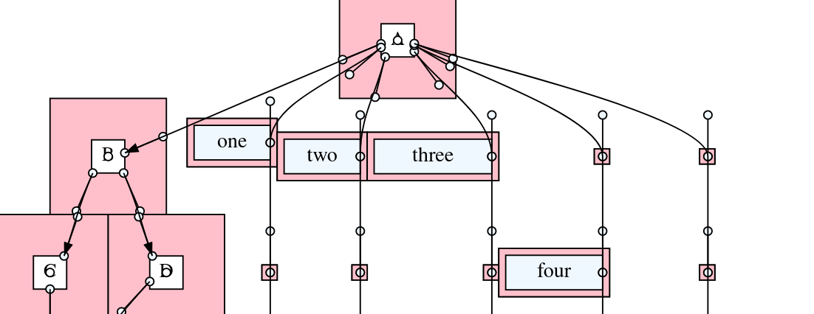

# Layout

Layout is a rust library and a stand alone utility that draws graphs. Layout
can parse Graphviz dot files and render them.


## Library Usage

Add the following to `Cargo.toml`:

```toml
layout-rs = "0.1.2" # or
layout-rs = { version = "0.1.2", features = ["log"] }
```

Load, parse and print the AST:

```rust
use layout::gv;

let contents = "digraph { a -> b [label=\"foo\"]; }";
let mut parser = gv::DotParser::new(&contents);

match parser.process() {
    Ok(g) => gv::dump_ast(&g),
    Err(err) => {
        parser.print_error();
        # #[cfg(feature = "log")]
        log::error!("Error: {}", err);
    }
}
```

The example above would print the program AST, or a readable error message,
such as:

```txt
digraph {

node [fillcolor="purple"] A B;
node [fillcolor="orange"] Z;
node [fillcolor="green"] G; a = ;
                                ^
Error: Expected an identifier.
```


## Command Line Usage

Build the crate and render some dot files with the command

```bash
cargo run --bin run ./inputs/bk.dot -o output.svg
```

## Gallery

This section presents a few graphs that were rendered from dot files:

A simple graph.


A simple graph with multiple shapes and labels.


A graph with a few style properties.


A large graph that demonstrates the edge crossing elimination optimization.


Unicode, emoji and right-to-left languages:


Support for Records (nested structures):


Debug-mode rendering that helps to visualize the layout decisions:


