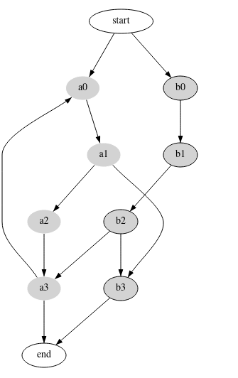
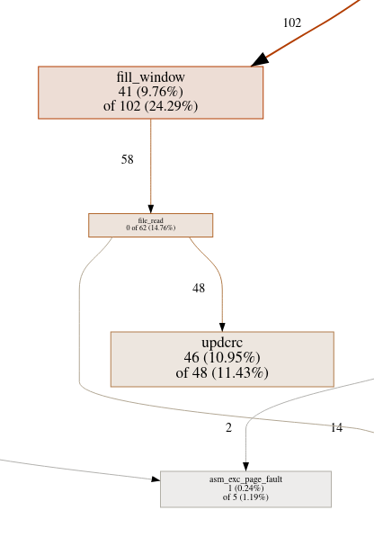
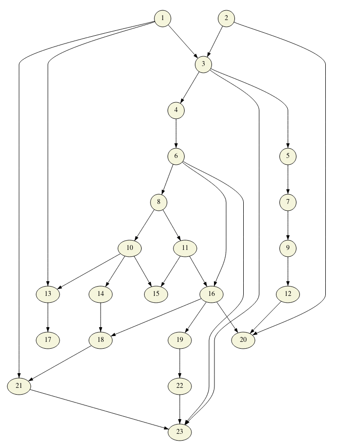
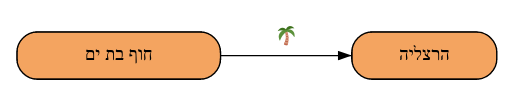
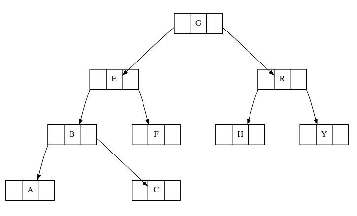

# Layout

Layout is a rust library and a stand alone utility that draws graphs. Layout
can parse Graphviz dot files and render them.

## Getting started

Build the crate and render some dot files with the command

```bash
crate run --bin run ./inputs/bk.dot -o output.svg
```

## Gallery

This section presents a few graphs that were rendered from dot files:

A simple graph.



A simple graph with multiple shapes and labels.


A graph with a few style properties.



A large graph that demonstrates the edge crossing elimination optimization.



Unicode, emoji and left-to-right languages:



Support for Records (nested structures):



